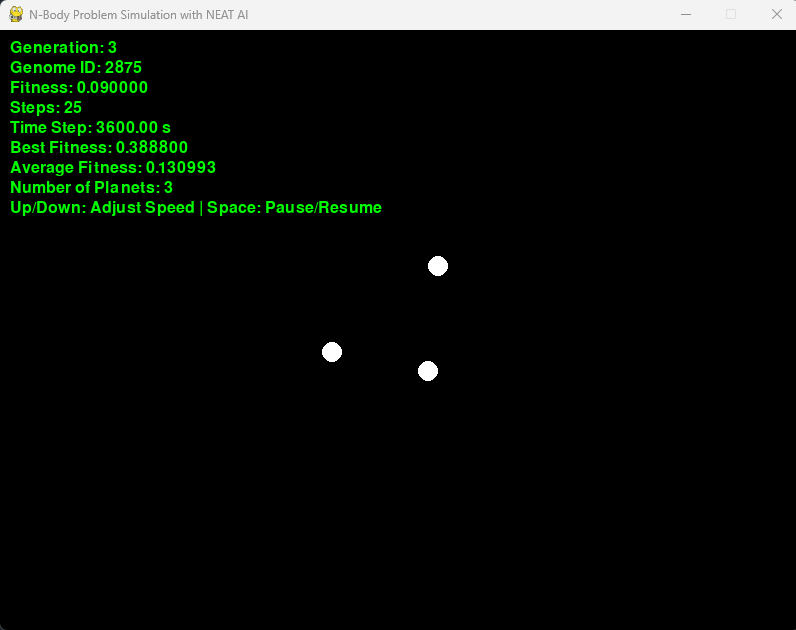

# N-Body Problem Simulation with NEAT AI 🪐🤖

Welcome to the **N-Body Problem Simulation with NEAT AI** project! This Python-based simulation leverages the power of the **NEAT (NeuroEvolution of Augmenting Topologies)** algorithm to evolve and simulate the motion of multiple planetary bodies under gravitational forces. This project uses Pygame for visualizations and NEAT-Python for neural network evolution.

## Table of Contents
- [Overview](#overview)
- [Features](#features)
- [Installation](#installation)
- [Usage](#usage)
- [Configuration](#configuration)
- [Project Structure](#project-structure)
- [How the AI Works](#how-the-ai-works)
- [Visualization](#visualization)
- [License](#license)

## Overview 📜
This project simulates an **N-body gravitational system**, where planets are attracted to each other following Newton's law of gravitation. It uses a **neural network** evolved with **NEAT** to determine the initial conditions (position and velocity) for each planet. The goal is to evolve stable or interesting systems using fitness-based evaluations.

The core idea is to explore how neural networks can generate stable orbits or controlled planetary systems in a dynamically evolving gravitational context.

## Features ✨
- **Gravitational simulation** of multiple planetary bodies.
- **NEAT-based neural network** evolution to discover optimal initial conditions.
- **Fitness visualization** over generations.
- **Pygame-based real-time visualization** of the simulation.
- Configurable planet count and other simulation parameters.

## Installation 🛠️

1. **Clone the Repository**:
   ```bash
   git clone https://github.com/your-username/n-body-neat-simulation.git
   cd n-body-neat-simulation
   ```

2. **Create a Virtual Environment** (Optional but recommended):
   ```bash
   python -m venv env
   source env/bin/activate   # On Windows, use `env\Scripts\activate`
   ```

3. **Install Dependencies**:
   ```bash
   pip install -r requirements.txt
   ```

   Make sure you have the following dependencies:
   - `pygame`
   - `neat-python`
   - `numpy`
   - `matplotlib`

4. **Run the Simulation**:
   ```bash
   python ai.py
   ```

## Usage 🚀
After running the script, the program will prompt you to select the number of planets to simulate. You can then choose to start a new training session or load from a saved checkpoint.

### Keyboard Controls:
- **Up/Down Arrow Keys**: Adjust simulation speed.
- **Spacebar**: Pause or resume the simulation.

### Replay Options:
- **'r'**: Replay a specific genome using its ID.
- **'b'**: Replay the best genome so far.
- **'p'**: Plot the fitness history over generations.
- **'q'**: Quit the program.

## Configuration ⚙️
The configuration file for NEAT is automatically generated as `config-feedforward.txt` and contains adjustable parameters for:
- Population size
- Mutation rates
- Number of inputs/outputs
- Activation functions

Feel free to modify this file as needed to experiment with different evolutionary parameters.

## Project Structure 📂
```plaintext
n-body-neat-simulation/
│
├── ai.py                    # Main script for simulation and neural network evolution
├── config-feedforward.txt   # Configuration file for NEAT
├── requirements.txt         # Dependencies
└── README.md                # Project documentation
```

## How the AI Works 🤖🧠
The core algorithm used in this simulation is **NEAT (NeuroEvolution of Augmenting Topologies)**, which evolves a neural network to optimize the initial conditions for the planetary bodies. Here's a deeper look into how this works:

### 1. **Neural Network Structure**
The neural network evolved by NEAT takes a simple input vector to generate initial positions and velocities for each planet. The inputs consist of a **constant bias** (e.g., 1.0) to allow the neural network to generate consistent outputs. The outputs represent:

- **X and Y positions** of each planet.
- **X and Y velocities** of each planet.

### 2. **Evolution via NEAT**
The NEAT algorithm optimizes the neural network's weights, connections, and even its topology to find the best configuration for creating stable planetary orbits. This is achieved through:

- **Population-based search**: A population of neural networks is evolved simultaneously.
- **Fitness Evaluation**: Each neural network's fitness is determined based on how well the simulated planetary system behaves. Stability and lifespan are key indicators of good performance.

### 3. **Fitness Calculation**
The fitness function measures the stability and behavior of the planetary system:

- **Longevity of the system**: The main objective is to evolve networks that can create planetary systems that exist without collisions or escapes for as long as possible.
- **Penalties for collisions and escapes**: If planets collide or escape beyond a threshold, the simulation terminates early, and penalties are applied to the fitness score.

### 4. **Mutation and Crossover**
NEAT applies mutations and crossovers to generate a new population in each generation:

- **Mutations** involve adding or removing connections between nodes, or adjusting weights and biases.
- **Crossover** combines successful neural networks to create offspring with a mix of features from both parents.

### 5. **Training and Visualization**
The neural networks are trained over multiple generations, with the fitness of the best neural network being plotted over time. You can visualize the results in real time using **Pygame**.

## Visualization 🎨
The simulation is visualized using **Pygame**, which displays the current planetary system's state. Information such as generation, genome ID, fitness, and simulation speed is displayed in the Pygame window.



## License 📜
This project is licensed under the MIT License. See the [LICENSE](LICENSE) file for details.

---

Happy Simulating! 😊🚀🌌
